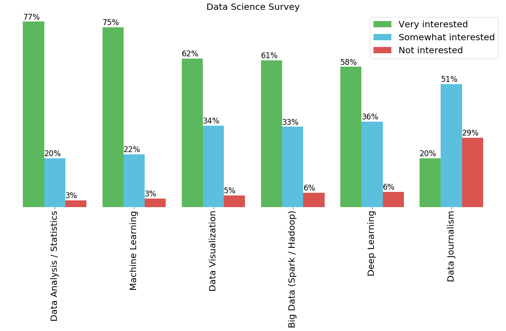

We begin by importing the different libraries we'll need.


```python
import pandas as pd
import numpy as np
%matplotlib inline 
import matplotlib as mpl
import matplotlib.pyplot as plt
```

Next we open the csv file and print its content.


```python
df=pd.read_csv('https://s3-api.us-geo.objectstorage.softlayer.net/cf-courses-data/CognitiveClass/DV0101EN/labs/coursera/Topic_Survey_Assignment.csv', index_col=0)
df.head()
```


<div>
<style scoped>
    .dataframe tbody tr th:only-of-type {
        vertical-align: middle;
    }

    .dataframe tbody tr th {
        vertical-align: top;
    }

    .dataframe thead th {
        text-align: right;
    }
</style>
<table border="1" class="dataframe">
  <thead>
    <tr style="text-align: right;">
      <th></th>
      <th>Very interested</th>
      <th>Somewhat interested</th>
      <th>Not interested</th>
    </tr>
  </thead>
  <tbody>
    <tr>
      <td>Big Data (Spark / Hadoop)</td>
      <td>1332</td>
      <td>729</td>
      <td>127</td>
    </tr>
    <tr>
      <td>Data Analysis / Statistics</td>
      <td>1688</td>
      <td>444</td>
      <td>60</td>
    </tr>
    <tr>
      <td>Data Journalism</td>
      <td>429</td>
      <td>1081</td>
      <td>610</td>
    </tr>
    <tr>
      <td>Data Visualization</td>
      <td>1340</td>
      <td>734</td>
      <td>102</td>
    </tr>
    <tr>
      <td>Deep Learning</td>
      <td>1263</td>
      <td>770</td>
      <td>136</td>
    </tr>
  </tbody>
</table>
</div>


Here we sort the values in descending order using the *.sort_values* command


```python
df1= df.sort_values("Not interested")
df1.head()
```


<div>
<style scoped>
    .dataframe tbody tr th:only-of-type {
        vertical-align: middle;
    }

    .dataframe tbody tr th {
        vertical-align: top;
    }

    .dataframe thead th {
        text-align: right;
    }
</style>
<table border="1" class="dataframe">
  <thead>
    <tr style="text-align: right;">
      <th></th>
      <th>Very interested</th>
      <th>Somewhat interested</th>
      <th>Not interested</th>
    </tr>
  </thead>
  <tbody>
    <tr>
      <td>Data Analysis / Statistics</td>
      <td>1688</td>
      <td>444</td>
      <td>60</td>
    </tr>
    <tr>
      <td>Machine Learning</td>
      <td>1629</td>
      <td>477</td>
      <td>74</td>
    </tr>
    <tr>
      <td>Data Visualization</td>
      <td>1340</td>
      <td>734</td>
      <td>102</td>
    </tr>
    <tr>
      <td>Big Data (Spark / Hadoop)</td>
      <td>1332</td>
      <td>729</td>
      <td>127</td>
    </tr>
    <tr>
      <td>Deep Learning</td>
      <td>1263</td>
      <td>770</td>
      <td>136</td>
    </tr>
  </tbody>
</table>
</div>


We plot the bar graph of the dataset.


```python
colorlist= '#5cb85c', '#5bc0de', '#d9534f' #here 
bar=(df1.div(df1.sum(1), axis=0)).plot(kind='bar', 
        figsize=(20, 8),
       color=colorlist,
       width=0.8)
plt.title('Data Science Survey', fontsize=20) #the Title of the bar graph
plt.legend(labels=df.columns, fontsize=20) #we specify the legend using the dataframe columns
plt.xticks(fontsize=20) #change the font size of the x axis
#Finally we add the perentage ontop of the bars
for spine in plt.gca().spines.values():
    spine.set_visible(False)
plt.yticks([])
for p in bar.patches:
    width, height=p.get_width(), p.get_height()
    x, y= p.get_xy()
    bar.annotate('{:.0%}'.format(height), (x, y + height + 0.01), fontsize=17)
```





## Section 2 San Fran crime data

we install then import the folium library


```python
#!conda install -c conda-forge folium=0.5.0 --yes
import folium

print('Folium installed and imported!')
```

    Folium installed and imported!


Next we open the csv file.


```python
df2 = pd.read_csv('Police_Department_Incidents-2016.csv')
print('Data downloaded and read into a dataframe!')
```

    Data downloaded and read into a dataframe!


```python
#Here we print out the first row of the data, this will include all of the columns
df2.head(1)
```


<div>
<style scoped>
    .dataframe tbody tr th:only-of-type {
        vertical-align: middle;
    }

    .dataframe tbody tr th {
        vertical-align: top;
    }

    .dataframe thead th {
        text-align: right;
    }
</style>
<table border="1" class="dataframe">
  <thead>
    <tr style="text-align: right;">
      <th></th>
      <th>IncidntNum</th>
      <th>Category</th>
      <th>Descript</th>
      <th>DayOfWeek</th>
      <th>Date</th>
      <th>Time</th>
      <th>PdDistrict</th>
      <th>Resolution</th>
      <th>Address</th>
      <th>X</th>
      <th>Y</th>
      <th>Location</th>
      <th>PdId</th>
    </tr>
  </thead>
  <tbody>
    <tr>
      <td>0</td>
      <td>120058272</td>
      <td>WEAPON LAWS</td>
      <td>POSS OF PROHIBITED WEAPON</td>
      <td>Friday</td>
      <td>01/29/2016 12:00:00 AM</td>
      <td>11:00</td>
      <td>SOUTHERN</td>
      <td>ARREST, BOOKED</td>
      <td>800 Block of BRYANT ST</td>
      <td>-122.403405</td>
      <td>37.775421</td>
      <td>(37.775420706711, -122.403404791479)</td>
      <td>12005827212120</td>
    </tr>
  </tbody>
</table>
</div>


Now we clean the dataset.


```python
# clean up the dataset to remove unnecessary columns (eg. REG) 
df2.drop(['IncidntNum','Category','Descript','DayOfWeek','Date','Time','Resolution','Address','X','Y','Location','PdId'], axis=1, inplace=True)

# let's rename the columns so that they make sense
df2.rename(columns={'PdDistrict':'Hood'}, inplace=True)

# for sake of consistency, let's also make all column labels of type string
df2.columns = list(map(str, df2.columns))

# years that we will be using in this lesson - useful for plotting later on
print ('data dimensions:', df2.shape)
```

    data dimensions: (150500, 1)


#### Here we will create a new data frame with the information we've gathered 


```python
#we begin by getting unique values of each neighborhood
df3 = df2['Hood'].value_counts()
df3
```


    SOUTHERN      28445
    NORTHERN      20100
    MISSION       19503
    CENTRAL       17666
    BAYVIEW       14303
    INGLESIDE     11594
    TARAVAL       11325
    TENDERLOIN     9942
    RICHMOND       8922
    PARK           8699
    Name: Hood, dtype: int64


```python
#from the above data we create a new data frame
data= {'Hood': ['SOUTHERN', 'NORTHERN', 'MISSION', 'CENTRAL', 'BAYVIEW', 'INGLESIDE', 'TARAVAL', 'TENDERLOIN', 'RICHMOND', 'PARK'],
      'Count': [28445, 20100, 19503, 17666, 14303, 11594, 11325,  9942, 8922, 8699]}
```


```python
df4=pd.DataFrame(data)
```


```python
# here we show the content of the new dataframe
df4.head()
```


<div>
<style scoped>
    .dataframe tbody tr th:only-of-type {
        vertical-align: middle;
    }

    .dataframe tbody tr th {
        vertical-align: top;
    }

    .dataframe thead th {
        text-align: right;
    }
</style>
<table border="1" class="dataframe">
  <thead>
    <tr style="text-align: right;">
      <th></th>
      <th>Hood</th>
      <th>Count</th>
    </tr>
  </thead>
  <tbody>
    <tr>
      <td>0</td>
      <td>SOUTHERN</td>
      <td>28445</td>
    </tr>
    <tr>
      <td>1</td>
      <td>NORTHERN</td>
      <td>20100</td>
    </tr>
    <tr>
      <td>2</td>
      <td>MISSION</td>
      <td>19503</td>
    </tr>
    <tr>
      <td>3</td>
      <td>CENTRAL</td>
      <td>17666</td>
    </tr>
    <tr>
      <td>4</td>
      <td>BAYVIEW</td>
      <td>14303</td>
    </tr>
  </tbody>
</table>
</div>


now we import the geojson file for San Fran.


```python
# download cities geojson file
sf_geo = r'san-fran.json'
#we set the coordinates for San Fran
sf_map = folium.Map(location=[37.77, -122.42], zoom_start=11)

print('GeoJSON file downloaded!')
```

    GeoJSON file downloaded!


#### Finally we plot the Choropleth graph


```python
threshold_scale = np.linspace(df4['Count'].min(),
                              df4['Count'].max(),
                              6, dtype=int)
threshold_scale = threshold_scale.tolist() # change the numpy array to a list
threshold_scale[-1] = threshold_scale[-1] + 1 
# make sure that the last value of the list is greater than the maximum immigration

sf_map = folium.Map(location=[37.77, -122.42], zoom_start=11)
sf_map.choropleth(
    geo_data=sf_geo,
    data=df4,
    columns=['Hood', 'Count'],
    key_on='feature.properties.DISTRICT',
    threshold_scale=threshold_scale,
    fill_color='YlOrRd', 
    fill_opacity=0.7, 
    line_opacity=0.3,
    legend_name='Crime in San Fran',
    reset=True    
)

# display map
sf_map
```


<div style="width:100%;"><div style="position:relative;width:100%;height:0;padding-bottom:60%;">

```python

```
